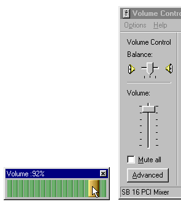

## One Hundred Percent Pure volume

### Description

one hundred percent pure volume is a horizontal Volume slider

like you've NEVER seen before, built in raw vb6 code with no

other add-ons this code is modular, re-usable and 100% completely

Height, Width and position idenpendant.

it uses standard picture boxes to "act like" or "mimmick" a sliders

appearance, because it uses standard picture boxes, you can skin

the volume slider to any picture and dimension in the world, just

by selecting it's .picture filename property.

if you set it to 20,000 pixels wide it will still retain 100%

functionality. uttermost left of the main background picture will

remain 0%, uttermost right of the main background picture will

remain 100%, no matter how wide, high or what position left the

main background picture is set at.

It uses ADVANCED relational percentage math to calculate the

percentage value used to set the windows volume,hence its name :

One Hundred Percent Pure Volume.

use it in an MP3 Player, sound app or anything that could

use this totally unique FULLY Skinable windows volume slider.

It took me approximately 2 whole days to Just to work out the math

behind One Hundred Percent Pure volume.

It's yours for free, Enjoy. Tom Brett, CEO soundgrabber.com
 
### More Info
 

             |
---                |---
**Submitted On**   |2001-03-16 15:45:48
**By**             |[GShare Technologies](https://github.com/Planet-Source-Code/PSCIndex/blob/master/ByAuthor/gshare-technologies.md)
**Level**          |Intermediate
**User Rating**    |4.0 (24 globes from 6 users)
**Compatibility**  |VB 6\.0
**Category**       |[Custom Controls/ Forms/  Menus](https://github.com/Planet-Source-Code/PSCIndex/blob/master/ByCategory/custom-controls-forms-menus__1-4.md)
**World**          |[Visual Basic](https://github.com/Planet-Source-Code/PSCIndex/blob/master/ByWorld/visual-basic.md)
**Archive File**   |[CODE\_UPLOAD171363162001\.zip](https://github.com/Planet-Source-Code/gshare-technologies-one-hundred-percent-pure-volume__1-21685/archive/master.zip)

